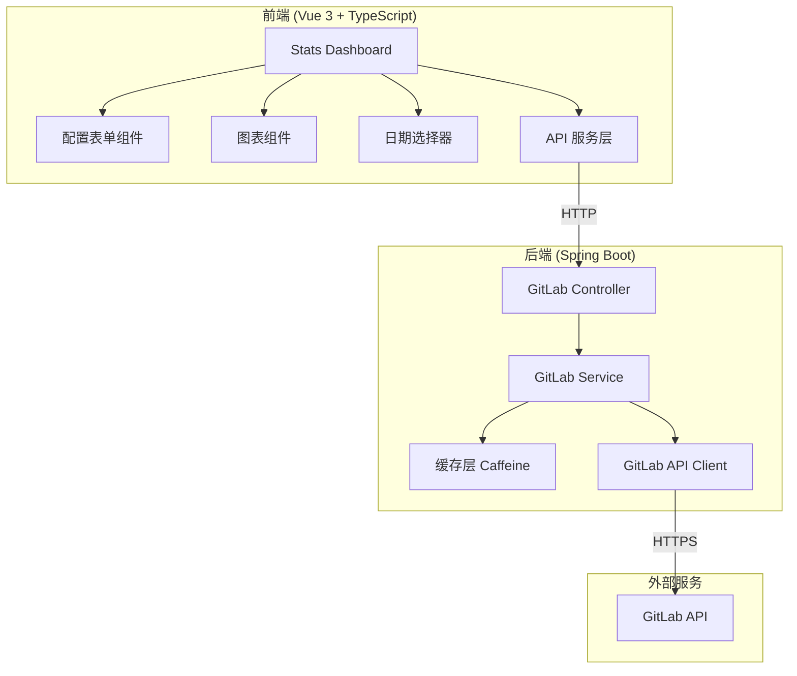
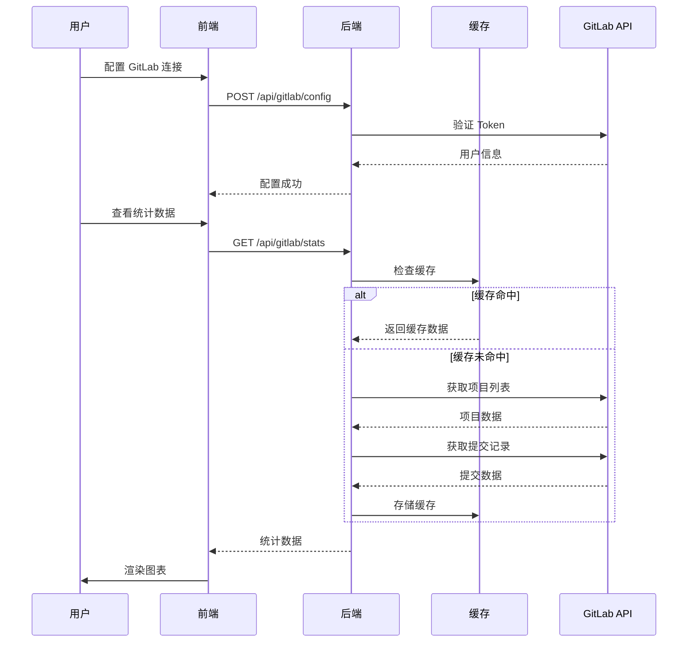

# Design Document: GitLab Commit Stats

## Overview

GitLab 提交统计可视化功能是一个全栈应用，用于展示个人用户在 GitLab 上的提交活动数据。系统采用前后端分离架构，后端通过 Spring Boot 提供 RESTful API，负责与 GitLab API 通信并处理数据；前端使用 Vue 3 构建交互式仪表盘，通过 ECharts 渲染统计图表。

### 核心功能

1. **GitLab 连接配置**：用户配置 GitLab 服务器地址、用户名和访问令牌
2. **数据获取与处理**：后端调用 GitLab API 获取用户提交记录并进行统计处理
3. **可视化展示**：前端以折线图、饼图等形式展示提交趋势和分布
4. **日期筛选**：支持按时间范围筛选提交数据
5. **响应式布局**：适配桌面端、平板端和移动端

### 技术选型

| 层级 | 技术 | 说明 |
|------|------|------|
| 前端框架 | Vue 3.5 + TypeScript | Composition API + script setup |
| 构建工具 | Vite 8 | 快速开发和构建 |
| 图表库 | ECharts 5 | 功能丰富、性能优秀 |
| 后端框架 | Spring Boot 2.7.18 | Java 8 兼容 |
| HTTP 客户端 | RestTemplate | 调用 GitLab API |
| 缓存 | Caffeine | 本地缓存 GitLab API 响应 |

## Architecture

### 系统架构图



### 数据流图



## Components and Interfaces

### 前端组件结构

```
frontend/src/
├── views/
│   └── GitLabStats.vue          # 主页面组件
├── components/
│   └── gitlab-stats/
│       ├── ConfigForm.vue       # GitLab 配置表单
│       ├── StatsOverview.vue    # 统计概览卡片
│       ├── CommitLineChart.vue  # 提交趋势折线图
│       ├── ProjectPieChart.vue  # 项目分布饼图
│       └── DateRangeSelector.vue # 日期范围选择器
├── services/
│   └── gitlabService.ts         # GitLab API 服务
├── hooks/
│   └── useGitLabStats.ts        # 统计数据组合式函数
└── const/
    └── gitlabStats.ts           # 常量定义
```

### 前端组件接口

#### ConfigForm.vue

```typescript
// Props
interface ConfigFormProps {
  initialConfig?: GitLabConfig
}

// Emits
interface ConfigFormEmits {
  (e: 'submit', config: GitLabConfig): void
  (e: 'success'): void
  (e: 'error', message: string): void
}

// GitLabConfig 类型
interface GitLabConfig {
  serverUrl: string
  username: string
  token: string
}
```

#### StatsOverview.vue

```typescript
// Props
interface StatsOverviewProps {
  totalCommits: number
  activeDays: number
  avgDailyCommits: number
  projectCount: number
  loading?: boolean
}
```

#### CommitLineChart.vue

```typescript
// Props
interface CommitLineChartProps {
  data: DailyCommitData[]
  loading?: boolean
}

interface DailyCommitData {
  date: string      // YYYY-MM-DD
  count: number
}
```

#### ProjectPieChart.vue

```typescript
// Props
interface ProjectPieChartProps {
  data: ProjectCommitData[]
  loading?: boolean
}

interface ProjectCommitData {
  projectName: string
  commitCount: number
}
```

#### DateRangeSelector.vue

```typescript
// Props
interface DateRangeSelectorProps {
  startDate: string
  endDate: string
}

// Emits
interface DateRangeSelectorEmits {
  (e: 'change', range: DateRange): void
}

interface DateRange {
  startDate: string
  endDate: string
}
```

### 后端包结构

```
backend/src/main/java/com/example/
├── Application.java
├── controller/
│   └── GitLabController.java    # REST 控制器
├── service/
│   ├── GitLabService.java       # 服务接口
│   └── GitLabServiceImpl.java   # 服务实现
├── client/
│   └── GitLabApiClient.java     # GitLab API 客户端
├── dto/
│   ├── GitLabConfigRequest.java # 配置请求 DTO
│   ├── CommitStatsResponse.java # 统计响应 DTO
│   └── CommitRecordDTO.java     # 提交记录 DTO
├── model/
│   └── GitLabConfig.java        # 配置实体
├── config/
│   └── CacheConfig.java         # 缓存配置
└── exception/
    ├── GitLabApiException.java  # GitLab API 异常
    └── GlobalExceptionHandler.java # 全局异常处理
```

### 后端接口定义

#### GitLabController

```java
@RestController
@RequestMapping("/api/gitlab")
public class GitLabController {
    
    /**
     * 保存并验证 GitLab 配置
     * @param request 配置请求
     * @return 验证结果
     */
    @PostMapping("/config")
    public ResponseEntity<ConfigResponse> saveConfig(
        @Valid @RequestBody GitLabConfigRequest request);
    
    /**
     * 获取提交记录列表
     * @param startDate 开始日期
     * @param endDate 结束日期
     * @return 提交记录列表
     */
    @GetMapping("/commits")
    public ResponseEntity<List<CommitRecordDTO>> getCommits(
        @RequestParam @DateTimeFormat(pattern = "yyyy-MM-dd") LocalDate startDate,
        @RequestParam @DateTimeFormat(pattern = "yyyy-MM-dd") LocalDate endDate);
    
    /**
     * 获取统计汇总数据
     * @param startDate 开始日期
     * @param endDate 结束日期
     * @return 统计数据
     */
    @GetMapping("/stats")
    public ResponseEntity<CommitStatsResponse> getStats(
        @RequestParam @DateTimeFormat(pattern = "yyyy-MM-dd") LocalDate startDate,
        @RequestParam @DateTimeFormat(pattern = "yyyy-MM-dd") LocalDate endDate);
}
```

#### GitLabService

```java
public interface GitLabService {
    
    /**
     * 验证并保存 GitLab 配置
     * @param config 配置信息
     * @return 验证结果
     */
    ConfigResult validateAndSaveConfig(GitLabConfig config);
    
    /**
     * 获取指定日期范围内的提交记录
     * @param startDate 开始日期
     * @param endDate 结束日期
     * @return 提交记录列表
     */
    List<CommitRecord> getCommits(LocalDate startDate, LocalDate endDate);
    
    /**
     * 获取统计汇总数据
     * @param startDate 开始日期
     * @param endDate 结束日期
     * @return 统计数据
     */
    CommitStats getStats(LocalDate startDate, LocalDate endDate);
    
    /**
     * 刷新缓存数据
     */
    void refreshCache();
}
```

### API 服务层 (前端)

```typescript
// services/gitlabService.ts

const BASE_URL = '/api/gitlab'

/**
 * 保存并验证 GitLab 配置
 */
export const saveGitLabConfig = (config: GitLabConfig): Promise<ConfigResponse> => {
  return post(`${BASE_URL}/config`, config)
}

/**
 * 获取提交记录列表
 */
export const getCommitList = (params: DateRangeParams): Promise<CommitRecord[]> => {
  return get(`${BASE_URL}/commits`, params)
}

/**
 * 获取统计汇总数据
 */
export const getCommitStats = (params: DateRangeParams): Promise<CommitStats> => {
  return get(`${BASE_URL}/stats`, params)
}
```


## Data Models

### 前端数据模型

```typescript
// types/gitlab.ts

/** GitLab 配置 */
interface GitLabConfig {
  serverUrl: string
  username: string
  token: string
}

/** 配置响应 */
interface ConfigResponse {
  success: boolean
  message: string
  userId?: number
  userName?: string
}

/** 日期范围参数 */
interface DateRangeParams {
  startDate: string  // YYYY-MM-DD
  endDate: string    // YYYY-MM-DD
}

/** 提交记录 */
interface CommitRecord {
  id: string
  shortId: string
  title: string
  message: string
  authorName: string
  authorEmail: string
  committedDate: string
  projectId: number
  projectName: string
}

/** 统计汇总数据 */
interface CommitStats {
  totalCommits: number
  activeDays: number
  avgDailyCommits: number
  projectCount: number
  dailyCommits: DailyCommitData[]
  projectCommits: ProjectCommitData[]
  lastUpdated: string
}

/** 每日提交数据 */
interface DailyCommitData {
  date: string
  count: number
}

/** 项目提交数据 */
interface ProjectCommitData {
  projectId: number
  projectName: string
  commitCount: number
}
```

### 后端数据模型

#### 请求 DTO

```java
// dto/GitLabConfigRequest.java
@Getter
@Setter
public class GitLabConfigRequest {
    
    @NotBlank(message = "GitLab 服务器地址不能为空")
    @Pattern(regexp = "^https?://.*", message = "服务器地址格式无效")
    private String serverUrl;
    
    @NotBlank(message = "用户名不能为空")
    private String username;
    
    @NotBlank(message = "访问令牌不能为空")
    private String token;
}
```

#### 响应 DTO

```java
// dto/ConfigResponse.java
@Getter
@Setter
@Builder
public class ConfigResponse {
    private boolean success;
    private String message;
    private Long userId;
    private String userName;
}

// dto/CommitRecordDTO.java
@Getter
@Setter
@Builder
public class CommitRecordDTO {
    private String id;
    private String shortId;
    private String title;
    private String message;
    private String authorName;
    private String authorEmail;
    private LocalDateTime committedDate;
    private Long projectId;
    private String projectName;
}

// dto/CommitStatsResponse.java
@Getter
@Setter
@Builder
public class CommitStatsResponse {
    private int totalCommits;
    private int activeDays;
    private double avgDailyCommits;
    private int projectCount;
    private List<DailyCommitDTO> dailyCommits;
    private List<ProjectCommitDTO> projectCommits;
    private LocalDateTime lastUpdated;
}

// dto/DailyCommitDTO.java
@Getter
@Setter
@AllArgsConstructor
public class DailyCommitDTO {
    private String date;
    private int count;
}

// dto/ProjectCommitDTO.java
@Getter
@Setter
@AllArgsConstructor
public class ProjectCommitDTO {
    private Long projectId;
    private String projectName;
    private int commitCount;
}
```

#### 内部模型

```java
// model/GitLabConfig.java
@Getter
@Setter
public class GitLabConfig {
    private String serverUrl;
    private String username;
    private String token;
    private Long userId;
}

// model/CommitRecord.java
@Getter
@Setter
public class CommitRecord {
    private String id;
    private String shortId;
    private String title;
    private String message;
    private String authorName;
    private String authorEmail;
    private LocalDateTime committedDate;
    private Long projectId;
    private String projectName;
}

// model/CommitStats.java
@Getter
@Setter
public class CommitStats {
    private int totalCommits;
    private int activeDays;
    private double avgDailyCommits;
    private int projectCount;
    private Map<LocalDate, Integer> dailyCommits;
    private Map<Long, ProjectCommitInfo> projectCommits;
}
```

### GitLab API 响应模型

```java
// client/dto/GitLabUserResponse.java
@Getter
@Setter
public class GitLabUserResponse {
    private Long id;
    private String username;
    private String name;
    private String email;
}

// client/dto/GitLabProjectResponse.java
@Getter
@Setter
public class GitLabProjectResponse {
    private Long id;
    private String name;
    private String pathWithNamespace;
    private String webUrl;
}

// client/dto/GitLabCommitResponse.java
@Getter
@Setter
public class GitLabCommitResponse {
    private String id;
    private String shortId;
    private String title;
    private String message;
    private String authorName;
    private String authorEmail;
    private String committedDate;
}
```

### 数据库设计（可选扩展）

当前版本使用内存存储配置信息。如需持久化，可扩展以下表结构：

```sql
-- 用户配置表
CREATE TABLE gitlab_config (
    id BIGINT PRIMARY KEY AUTO_INCREMENT,
    server_url VARCHAR(255) NOT NULL,
    username VARCHAR(100) NOT NULL,
    token_encrypted VARCHAR(500) NOT NULL,
    user_id BIGINT,
    created_at TIMESTAMP DEFAULT CURRENT_TIMESTAMP,
    updated_at TIMESTAMP DEFAULT CURRENT_TIMESTAMP ON UPDATE CURRENT_TIMESTAMP
);

-- 提交记录缓存表（可选）
CREATE TABLE commit_cache (
    id BIGINT PRIMARY KEY AUTO_INCREMENT,
    commit_id VARCHAR(50) NOT NULL,
    project_id BIGINT NOT NULL,
    project_name VARCHAR(255),
    author_name VARCHAR(100),
    committed_date TIMESTAMP,
    cached_at TIMESTAMP DEFAULT CURRENT_TIMESTAMP,
    INDEX idx_committed_date (committed_date),
    INDEX idx_project_id (project_id)
);
```


## Correctness Properties

*A property is a characteristic or behavior that should hold true across all valid executions of a system—essentially, a formal statement about what the system should do. Properties serve as the bridge between human-readable specifications and machine-verifiable correctness guarantees.*

### Property 1: Configuration Validation Behavior

*For any* GitLab configuration submission, if the configuration is valid (server URL reachable, token valid), the system should save the configuration and return success; if the configuration is invalid, the system should return an error message describing the failure reason without saving.

**Validates: Requirements 1.4, 1.5, 1.6**

### Property 2: Empty Username Rejection

*For any* string composed entirely of whitespace (including empty string), submitting it as the username should be rejected with a validation error, and no API call should be made.

**Validates: Requirements 1.7**

### Property 3: Complete Commit Retrieval

*For any* valid GitLab configuration and date range, the system should retrieve commits from all projects the user has access to, and the returned commit list should contain exactly the commits authored by the configured user within the specified date range.

**Validates: Requirements 2.2, 2.3**

### Property 4: Network Error Handling

*For any* network error during data fetching, the system should display an error message and provide a retry option, without crashing or leaving the UI in an inconsistent state.

**Validates: Requirements 2.4**

### Property 5: Statistics Calculation Correctness

*For any* set of commit records, the calculated statistics should satisfy:
- `totalCommits` equals the count of all commits
- `activeDays` equals the count of unique dates with at least one commit
- `avgDailyCommits` equals `totalCommits / activeDays` (or 0 if no active days)
- `projectCount` equals the count of unique projects with commits

**Validates: Requirements 3.3**

### Property 6: Date Range Filtering

*For any* date range (startDate, endDate) and any set of commits, the filtered result should contain exactly those commits where `startDate <= commitDate <= endDate`.

**Validates: Requirements 4.3**

### Property 7: Invalid Date Range Rejection

*For any* date range where endDate is earlier than startDate, the system should display a validation error and not perform any data filtering or API calls.

**Validates: Requirements 4.4**

### Property 8: Refresh State Management

*For any* refresh operation, the system should: (1) show loading indicator during the operation, (2) update the last refresh timestamp upon completion, (3) display the newly fetched data.

**Validates: Requirements 5.2, 5.3, 5.4**

### Property 9: Error Recovery During Refresh

*For any* error occurring during a refresh operation, the system should preserve the previously displayed data and show an error message, ensuring no data loss.

**Validates: Requirements 5.5**

### Property 10: API Error Status Codes

*For any* API request with invalid parameters, the system should return HTTP 400 with error details; *for any* request with invalid GitLab credentials, the system should return HTTP 401 with an authentication error message.

**Validates: Requirements 7.4, 7.5**

### Property 11: Cache Behavior

*For any* two identical API requests made within 5 minutes, the second request should return cached data without calling GitLab API; *for any* request made after 5 minutes since the last fetch, the system should call GitLab API to get fresh data.

**Validates: Requirements 7.6**

### Property 12: Chart Resize Responsiveness

*For any* browser window resize event, the chart components should adjust their dimensions to fit the new container size without requiring a page refresh.

**Validates: Requirements 6.4**

## Error Handling

### 前端错误处理

#### 网络错误

```typescript
// hooks/useGitLabStats.ts
const fetchStats = async () => {
  try {
    isLoading.value = true
    errorMessage.value = ''
    const data = await getCommitStats(dateRange.value)
    statsData.value = data
    lastUpdated.value = new Date().toISOString()
  } catch (error) {
    if (error instanceof NetworkError) {
      errorMessage.value = '网络连接失败，请检查网络后重试'
      canRetry.value = true
    } else if (error instanceof AuthError) {
      errorMessage.value = 'GitLab 认证失败，请检查配置'
      canRetry.value = false
    } else {
      errorMessage.value = '获取数据失败，请稍后重试'
      canRetry.value = true
    }
    // 保留之前的数据
  } finally {
    isLoading.value = false
  }
}
```

#### 表单验证错误

```typescript
// components/gitlab-stats/ConfigForm.vue
const validateForm = (): boolean => {
  errors.value = {}
  
  if (!formData.serverUrl?.trim()) {
    errors.value.serverUrl = '服务器地址不能为空'
  } else if (!/^https?:\/\//.test(formData.serverUrl)) {
    errors.value.serverUrl = '服务器地址格式无效'
  }
  
  if (!formData.username?.trim()) {
    errors.value.username = '用户名不能为空'
  }
  
  if (!formData.token?.trim()) {
    errors.value.token = '访问令牌不能为空'
  }
  
  return Object.keys(errors.value).length === 0
}
```

### 后端错误处理

#### 全局异常处理器

```java
@RestControllerAdvice
public class GlobalExceptionHandler {

    private static final Logger log = LoggerFactory.getLogger(GlobalExceptionHandler.class);

    @ExceptionHandler(GitLabApiException.class)
    public ResponseEntity<ErrorResponse> handleGitLabApiException(GitLabApiException e) {
        log.error("GitLab API error: {}", e.getMessage());
        
        if (e.getStatusCode() == 401) {
            return ResponseEntity.status(HttpStatus.UNAUTHORIZED)
                    .body(new ErrorResponse("GitLab 认证失败，请检查访问令牌"));
        }
        if (e.getStatusCode() == 429) {
            return ResponseEntity.status(HttpStatus.TOO_MANY_REQUESTS)
                    .body(new ErrorResponse("请求过于频繁，请稍后重试"));
        }
        return ResponseEntity.status(HttpStatus.BAD_GATEWAY)
                .body(new ErrorResponse("GitLab 服务暂时不可用"));
    }

    @ExceptionHandler(MethodArgumentNotValidException.class)
    public ResponseEntity<ErrorResponse> handleValidationException(
            MethodArgumentNotValidException e) {
        String message = e.getBindingResult().getFieldErrors().stream()
                .map(error -> error.getField() + ": " + error.getDefaultMessage())
                .collect(Collectors.joining(", "));
        return ResponseEntity.badRequest()
                .body(new ErrorResponse(message));
    }

    @ExceptionHandler(Exception.class)
    public ResponseEntity<ErrorResponse> handleException(Exception e) {
        log.error("Unexpected error", e);
        return ResponseEntity.status(HttpStatus.INTERNAL_SERVER_ERROR)
                .body(new ErrorResponse("服务器内部错误"));
    }
}
```

#### 自定义异常

```java
public class GitLabApiException extends RuntimeException {
    private final int statusCode;
    
    public GitLabApiException(String message, int statusCode) {
        super(message);
        this.statusCode = statusCode;
    }
    
    public int getStatusCode() {
        return statusCode;
    }
}
```

### 错误码定义

| HTTP 状态码 | 场景 | 错误信息 |
|------------|------|---------|
| 400 | 请求参数无效 | 具体的验证错误信息 |
| 401 | GitLab 认证失败 | GitLab 认证失败，请检查访问令牌 |
| 429 | GitLab API 速率限制 | 请求过于频繁，请稍后重试 |
| 502 | GitLab 服务不可用 | GitLab 服务暂时不可用 |
| 500 | 服务器内部错误 | 服务器内部错误 |

## Testing Strategy

### 测试框架

| 层级 | 框架 | 说明 |
|------|------|------|
| 前端单元测试 | Vitest | Vue 组件和工具函数测试 |
| 前端 E2E 测试 | Playwright | 端到端集成测试 |
| 后端单元测试 | JUnit 5 + Mockito | Service 层测试 |
| 后端集成测试 | Spring Boot Test | Controller 层测试 |
| 属性测试 | jqwik (后端) / fast-check (前端) | 基于属性的测试 |

### 单元测试策略

单元测试用于验证具体示例和边界情况：

#### 前端单元测试示例

```typescript
// __tests__/components/ConfigForm.spec.ts
describe('ConfigForm', () => {
  it('should show error when username is empty', async () => {
    // 具体示例测试
  })
  
  it('should validate server URL format', async () => {
    // 边界情况测试
  })
})
```

#### 后端单元测试示例

```java
// GitLabServiceTest.java
@ExtendWith(MockitoExtension.class)
class GitLabServiceTest {
    
    @Test
    void shouldReturnErrorWhenTokenInvalid() {
        // 具体示例测试
    }
    
    @Test
    void shouldHandleEmptyProjectList() {
        // 边界情况测试
    }
}
```

### 属性测试策略

属性测试用于验证通用属性，每个测试至少运行 100 次迭代。

#### 属性测试配置要求

- 每个属性测试必须运行至少 100 次迭代
- 每个属性测试必须通过注释引用设计文档中的属性
- 标签格式：**Feature: gitlab-commit-stats, Property {number}: {property_text}**

#### 后端属性测试示例 (jqwik)

```java
// GitLabServicePropertyTest.java
class GitLabServicePropertyTest {
    
    /**
     * Feature: gitlab-commit-stats, Property 5: Statistics Calculation Correctness
     */
    @Property(tries = 100)
    void statisticsCalculationShouldBeCorrect(
            @ForAll @Size(min = 0, max = 100) List<@From("commitGenerator") CommitRecord> commits) {
        CommitStats stats = statsCalculator.calculate(commits);
        
        assertThat(stats.getTotalCommits()).isEqualTo(commits.size());
        assertThat(stats.getActiveDays()).isEqualTo(
            commits.stream().map(c -> c.getCommittedDate().toLocalDate()).distinct().count()
        );
    }
    
    /**
     * Feature: gitlab-commit-stats, Property 6: Date Range Filtering
     */
    @Property(tries = 100)
    void dateRangeFilteringShouldBeCorrect(
            @ForAll @From("commitListGenerator") List<CommitRecord> commits,
            @ForAll @From("dateRangeGenerator") DateRange range) {
        List<CommitRecord> filtered = filterByDateRange(commits, range);
        
        assertThat(filtered).allMatch(c -> 
            !c.getCommittedDate().toLocalDate().isBefore(range.getStartDate()) &&
            !c.getCommittedDate().toLocalDate().isAfter(range.getEndDate())
        );
    }
}
```

#### 前端属性测试示例 (fast-check)

```typescript
// __tests__/utils/statsCalculator.property.spec.ts
import * as fc from 'fast-check'

describe('Statistics Calculator Properties', () => {
  /**
   * Feature: gitlab-commit-stats, Property 5: Statistics Calculation Correctness
   */
  it('should calculate correct statistics for any commit list', () => {
    fc.assert(
      fc.property(
        fc.array(commitRecordArbitrary, { minLength: 0, maxLength: 100 }),
        (commits) => {
          const stats = calculateStats(commits)
          
          expect(stats.totalCommits).toBe(commits.length)
          
          const uniqueDates = new Set(commits.map(c => c.committedDate.split('T')[0]))
          expect(stats.activeDays).toBe(uniqueDates.size)
        }
      ),
      { numRuns: 100 }
    )
  })
  
  /**
   * Feature: gitlab-commit-stats, Property 6: Date Range Filtering
   */
  it('should filter commits correctly for any date range', () => {
    fc.assert(
      fc.property(
        fc.array(commitRecordArbitrary),
        dateRangeArbitrary,
        (commits, range) => {
          const filtered = filterByDateRange(commits, range)
          
          filtered.forEach(commit => {
            const date = new Date(commit.committedDate)
            expect(date >= new Date(range.startDate)).toBe(true)
            expect(date <= new Date(range.endDate)).toBe(true)
          })
        }
      ),
      { numRuns: 100 }
    )
  })
})
```

### 测试覆盖要求

| 类型 | 覆盖目标 | 说明 |
|------|---------|------|
| 单元测试 | 核心业务逻辑 | Service 层、工具函数 |
| 属性测试 | 所有 Correctness Properties | 每个属性对应一个属性测试 |
| 集成测试 | API 端点 | Controller 层 |
| E2E 测试 | 关键用户流程 | 配置、查看统计、筛选 |

### 测试数据生成器

#### 后端生成器

```java
@Provide
Arbitrary<CommitRecord> commitGenerator() {
    return Combinators.combine(
        Arbitraries.strings().alpha().ofMinLength(7).ofMaxLength(40),
        Arbitraries.strings().alpha().ofMinLength(1).ofMaxLength(100),
        Arbitraries.longs().between(1, 1000),
        Arbitraries.strings().alpha().ofMinLength(1).ofMaxLength(50),
        localDateTimeArbitrary()
    ).as((id, title, projectId, projectName, date) -> {
        CommitRecord record = new CommitRecord();
        record.setId(id);
        record.setTitle(title);
        record.setProjectId(projectId);
        record.setProjectName(projectName);
        record.setCommittedDate(date);
        return record;
    });
}
```

#### 前端生成器

```typescript
const commitRecordArbitrary = fc.record({
  id: fc.hexaString({ minLength: 7, maxLength: 40 }),
  shortId: fc.hexaString({ minLength: 7, maxLength: 7 }),
  title: fc.string({ minLength: 1, maxLength: 100 }),
  message: fc.string({ maxLength: 500 }),
  authorName: fc.string({ minLength: 1, maxLength: 50 }),
  authorEmail: fc.emailAddress(),
  committedDate: fc.date({ min: new Date('2020-01-01'), max: new Date() })
    .map(d => d.toISOString()),
  projectId: fc.integer({ min: 1, max: 10000 }),
  projectName: fc.string({ minLength: 1, maxLength: 100 })
})

const dateRangeArbitrary = fc.tuple(
  fc.date({ min: new Date('2020-01-01'), max: new Date() }),
  fc.date({ min: new Date('2020-01-01'), max: new Date() })
).map(([d1, d2]) => ({
  startDate: (d1 < d2 ? d1 : d2).toISOString().split('T')[0],
  endDate: (d1 < d2 ? d2 : d1).toISOString().split('T')[0]
}))
```

