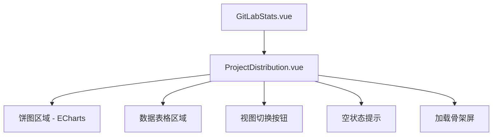
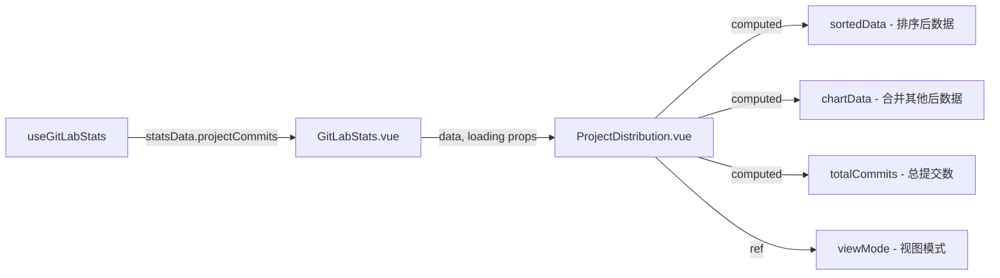

# 设计文档：项目分布展示增强

## 概述

本设计基于现有的 `ProjectPieChart.vue` 组件进行增强，将其升级为一个功能更完善的项目分布展示组件（`ProjectDistribution.vue`）。增强内容包括：数据表格、饼图中心汇总信息、"其他"类别合并、空数据状态、视图切换、响应式布局和加载骨架屏。

当前实现仅有一个简单的饼图组件，接收 `ProjectCommitData[]` 和 `loading` 属性。增强后的组件将在同一卡片容器内整合饼图和数据表格，并提供视图切换能力。

### 设计决策

1. **组件替换策略**：创建新的 `ProjectDistribution.vue` 组件替换现有的 `ProjectPieChart.vue`，而非在原组件上修改。原因是新组件职责范围显著扩大（包含表格、视图切换等），保持原组件不变有利于渐进式迁移。
2. **纯前端实现**：所有新增功能（排序、占比计算、"其他"合并、视图切换）均在前端完成，不需要后端 API 变更。现有 `CommitStats` 接口已返回完整的 `projectCommits` 数据。
3. **不引入 UI 组件库**：现有项目未使用 Element Plus 等 UI 库，所有组件均为原生实现。本设计延续此风格，使用原生 HTML + CSS 实现表格和按钮。

## 架构

### 组件层级



### 数据流



数据从 `useGitLabStats` composable 获取后，通过 props 传入 `ProjectDistribution.vue`。组件内部通过 computed 属性完成排序、占比计算和"其他"类别合并，不修改原始数据。

## 组件与接口

### ProjectDistribution.vue（新组件）

替换现有 `ProjectPieChart.vue`，在 `GitLabStats.vue` 中使用。

#### Props 接口

```typescript
const props = defineProps<{
  data: ProjectCommitData[]
  loading?: boolean
}>()
```

与现有 `ProjectPieChart.vue` 保持相同的 props 接口，确保在 `GitLabStats.vue` 中可以直接替换。

#### 内部状态

```typescript
// 视图模式：chart（图表+表格）或 table（纯表格）
const viewMode = ref<'chart' | 'table'>('chart')

// 表格行悬停索引
const hoveredRowIndex = ref<number | null>(null)
```

#### 计算属性

```typescript
// 总提交次数
const totalCommits = computed(() =>
  props.data.reduce((sum, item) => sum + item.commitCount, 0)
)

// 按提交次数降序排列
const sortedData = computed(() =>
  [...props.data].sort((a, b) => b.commitCount - a.commitCount)
)

// 带占比的表格数据
const tableData = computed(() =>
  sortedData.value.map(item => ({
    ...item,
    percentage: totalCommits.value > 0
      ? ((item.commitCount / totalCommits.value) * 100).toFixed(1)
      : '0.0'
  }))
)

// 饼图数据（超过10个项目时合并为"其他"）
const chartData = computed(() => {
  const sorted = sortedData.value
  if (sorted.length <= 10) return sorted
  const top9 = sorted.slice(0, 9)
  const otherCount = sorted.slice(9).reduce((sum, item) => sum + item.commitCount, 0)
  return [
    ...top9,
    { projectId: -1, projectName: '其他', commitCount: otherCount }
  ]
})
```

### GitLabStats.vue 变更

仅需将 `ProjectPieChart` 的引用替换为 `ProjectDistribution`：

```typescript
// 替换前
import ProjectPieChart from '@/components/gitlab-stats/ProjectPieChart.vue'
// 替换后
import ProjectDistribution from '@/components/gitlab-stats/ProjectDistribution.vue'
```

模板中组件名替换，props 保持不变。

### 无后端变更

现有 `CommitStats` 接口已包含 `projectCommits: ProjectCommitData[]`，数据结构满足所有需求。排序、占比计算、合并等逻辑均在前端 computed 中完成。

## 数据模型

### 现有类型（无需修改）

```typescript
/** 项目提交数据 - 已存在于 types/gitlab.ts */
interface ProjectCommitData {
  projectId: number
  projectName: string
  commitCount: number
}
```

### 新增内部类型

```typescript
/** 带占比的表格行数据（组件内部使用） */
interface ProjectTableRow extends ProjectCommitData {
  percentage: string  // 百分比字符串，如 "23.5"
}
```

此类型仅在 `ProjectDistribution.vue` 组件内部使用，不需要导出到 `types/gitlab.ts`。

